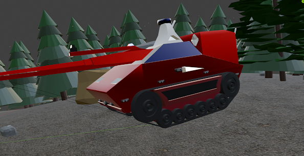
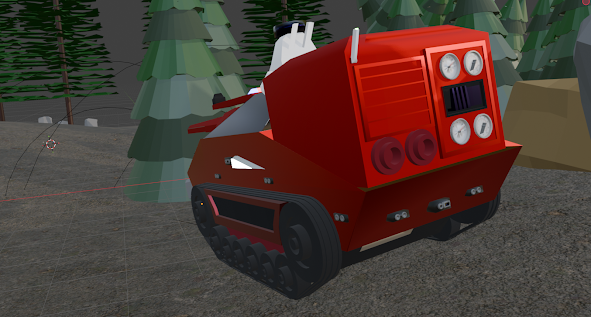
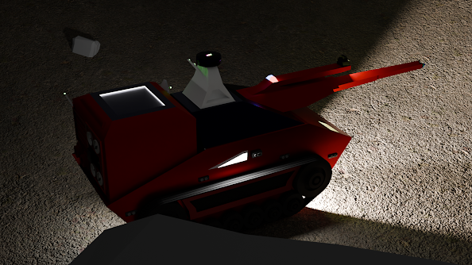
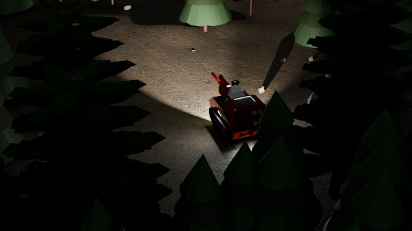
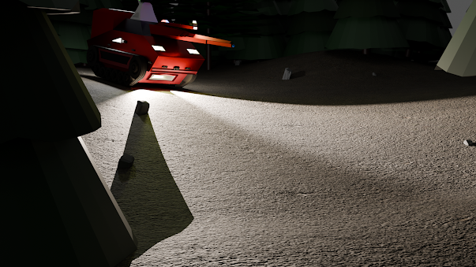

<video controls width="100%">
  <source src="/videos/video1.mp4" type="video/mp4">
</video>

Project RISE is a long-term emergency-response technology project focused on developing intelligent UGVs and UAVs to assist during fires and other hazardous situations.

The vision is to combine AI, computer vision, thermal sensing, and autonomous systems to help detect hazards, assess environments and support emergency responders—keeping humans away from unnecessary danger.

RISE isn't just a single robot. It's an evolving ecosystem. 🤖🚁

Starting with RISER V1, I'm developing and testing the individual technologies step by step, alongside my JEE studies

Built to explore. Built to protect. Built to RISE. 🚀

